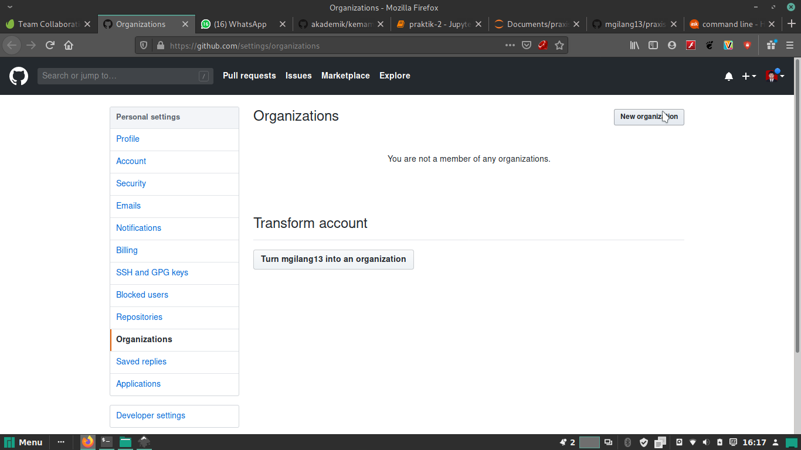
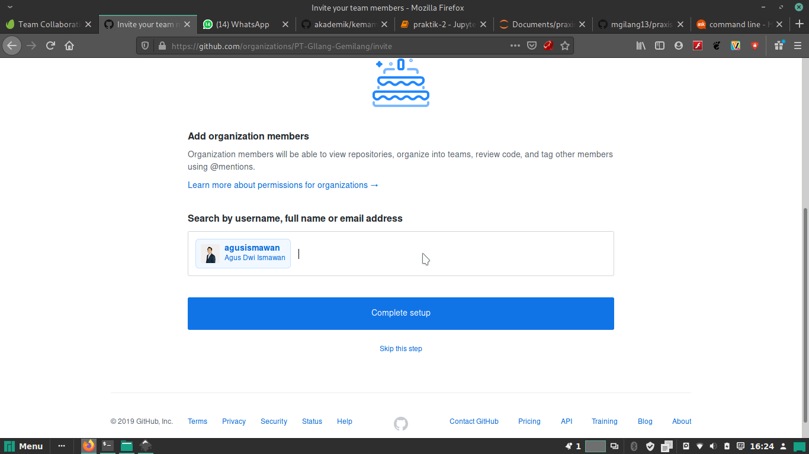
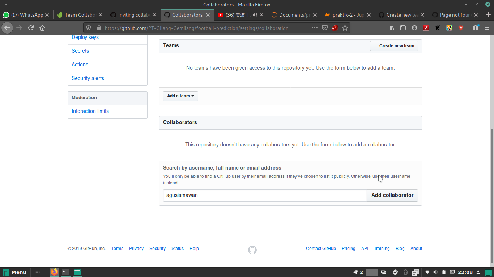
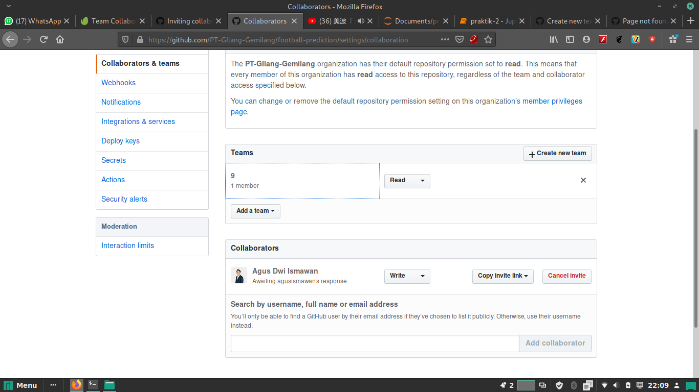
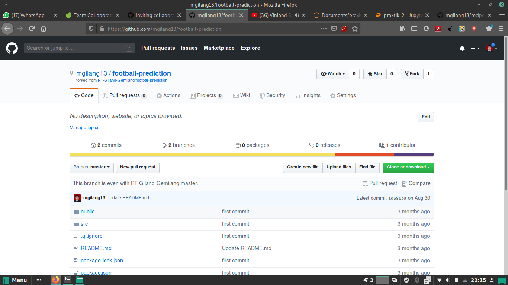
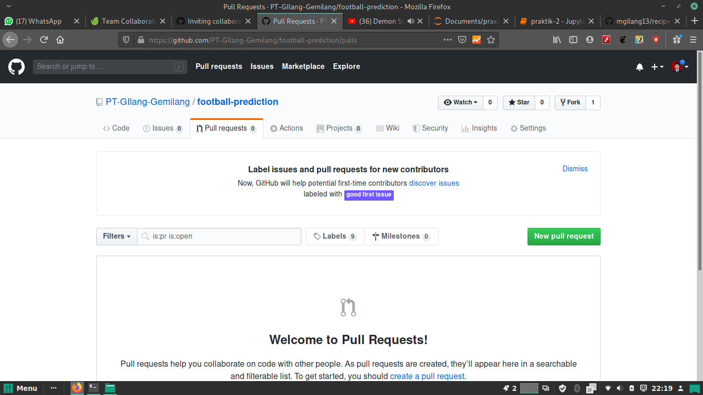

# Team Collaboration With GitHub

## 1. Adding Team Members - Organization & Collaborators

### Organization





### Collaborators


Adding team and collaborator


## 2. Pull Requests
Fork hampir sama seperti clone


Pull request dilakukan apabila terjadi perubahan pada repository



```python

```
