# Getting Started: Collaborative Development with Git

### Step 1: Creates new project and hosts it on Github
Pertama, kita membuat new project di akun github kita

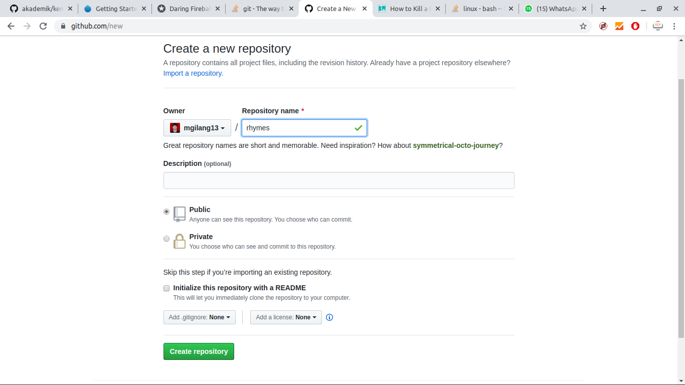

Kemudian kita membuat folder baru di local directory kita, dan mulai pushing 1 dokumen README.txt ke folder github yang baru saja dibuat.

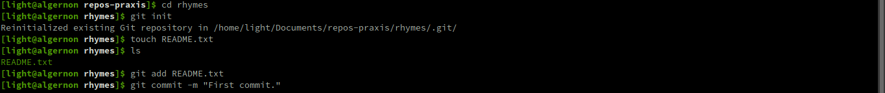
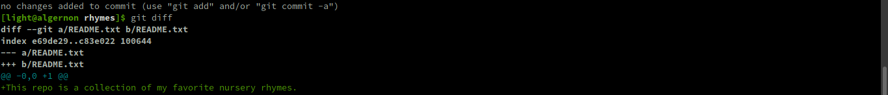

Kemudian menambahkan beberapa file
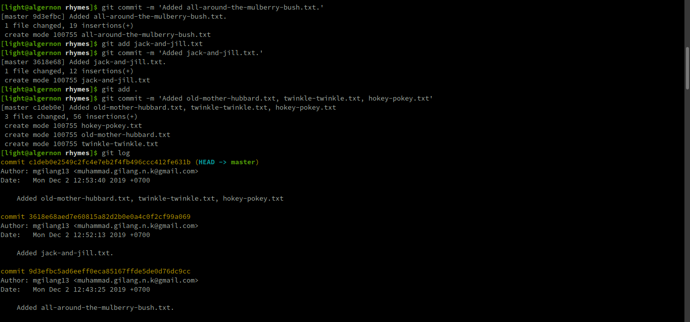
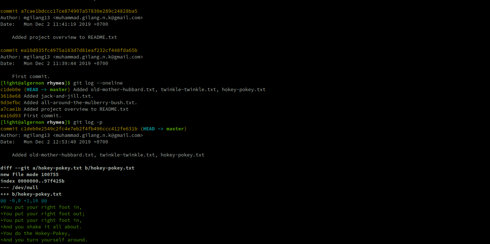


---

### Step 2: Add file hickory-dickory in hickory-dickory branch
Lalu misalkan bila ada anggota grup yang menambahkan file baru (hickory-dickory-dock.txt) pada branch baru (hickory-dickory)

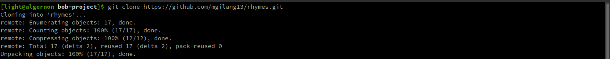
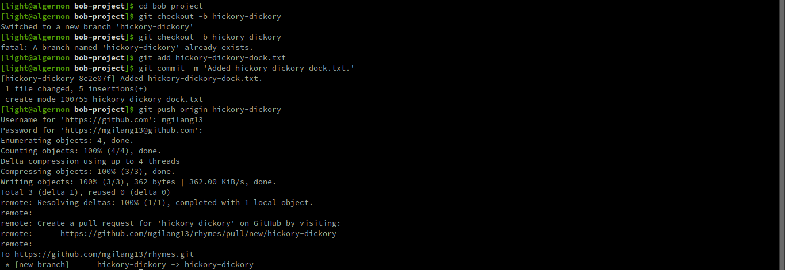

Maka pada gambar pada branch hickory-dickory dapat kita lihat file hickory-dickory-dock.txt berhasil ditambahkan
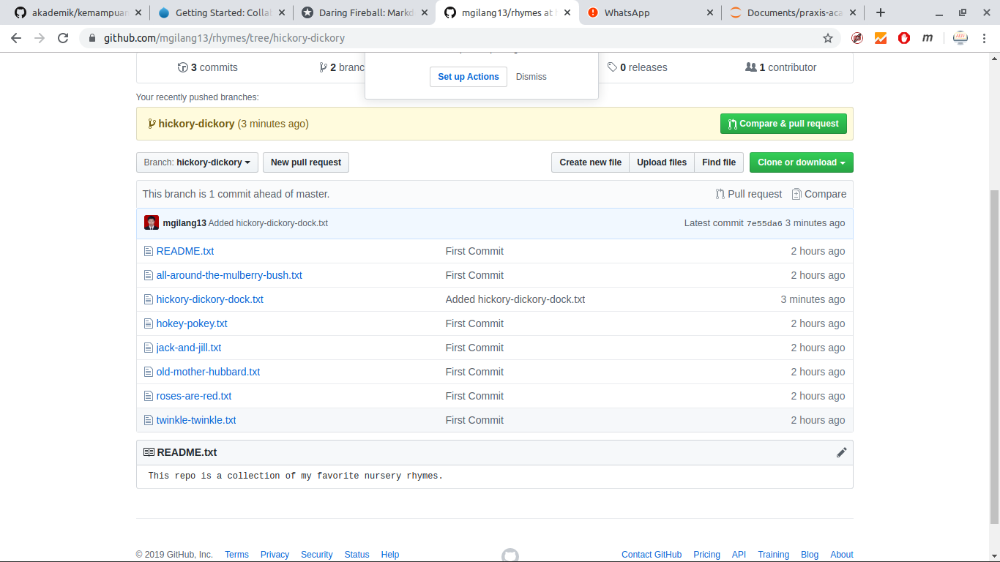

Sementara itu pada branch master, file hickory-dickory-dock.txt belum ditambahkan
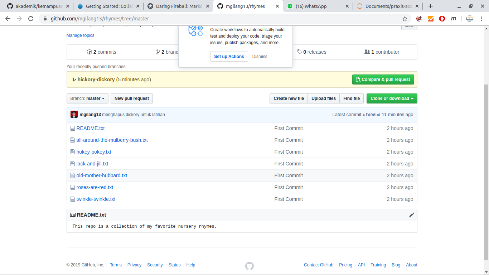


---
### Step 3: Review and accepts Bob's simple changes
Kemudian Alice melakukan rename pada semua remote-nya, termasuk pada remote-nya sendiri. Hal ini dilakukan untuk membedakan remote-nya Alice dan remote-nya Bob
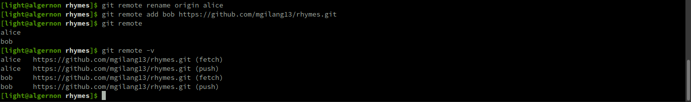

Setelah itu, Alice me-copy pekerjaan Bob dan melakukan merge dan push atas perubahan yang telah dilakukan oleh Bob tadi
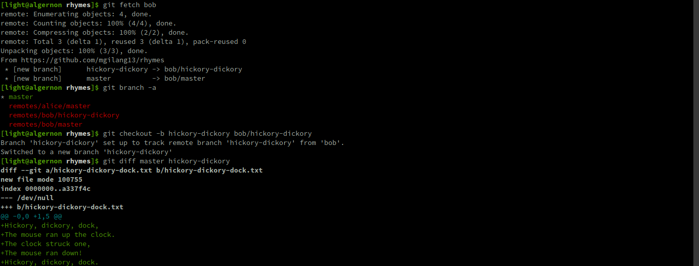
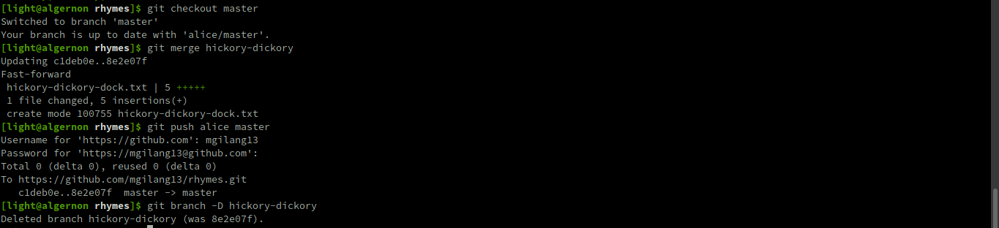

Maka, file hickory-dickory.dock.txt sudah ditambahkan di branch master (alice)
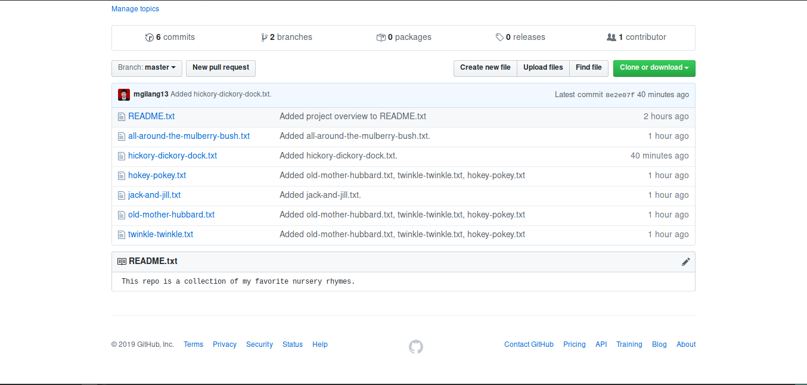


---
### Step 4: Bob makes lots of changes
Kemudian Bob memastikan updating pada repository-nya supaya up-to-date dengan repo-nya Alice
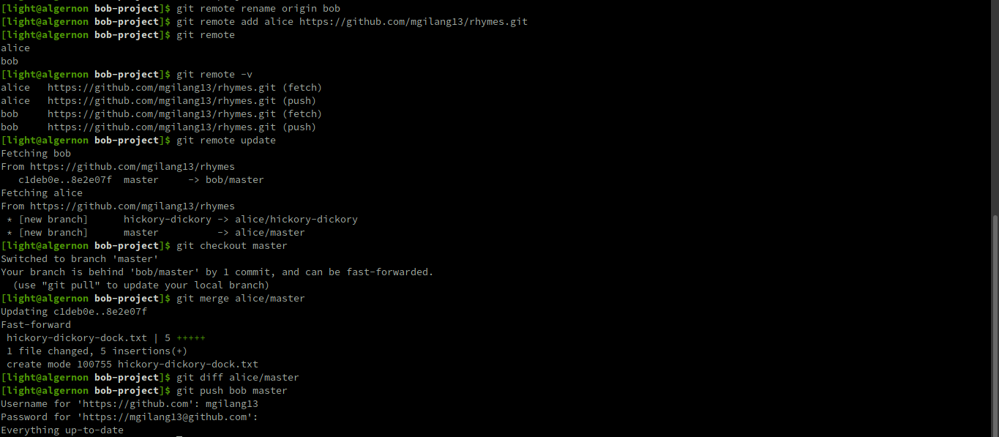

Bob membuat branch baru untuk membuat berbagai macam perubahan


Kemudian Bob melakukan penambahan beberapa file dan perubahan pada file README.txt
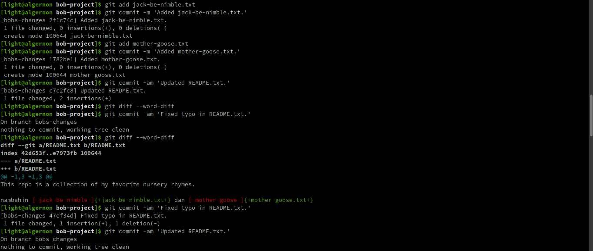

Bob me-review aktivitas log-nya
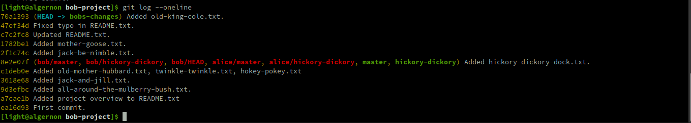


---
### Step 5: Bob cleans up his work before submitting
Bob menulis ulang history untuk mengurutkan kronologi dari proses perubahan yang telah dia lakukan.
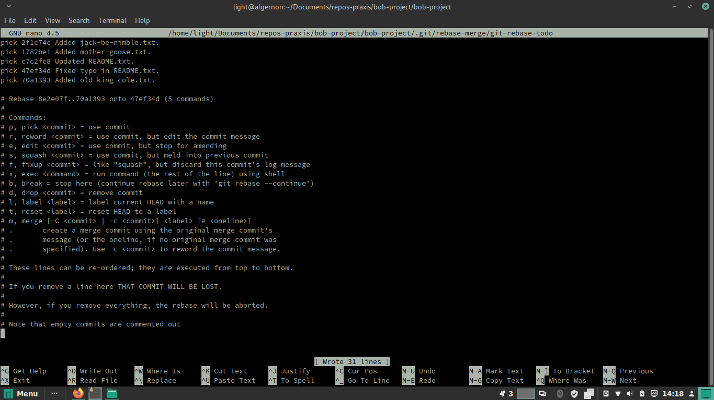

Kemudian bob melakukan squash untuk menggabungkan beberapa perubahan yang memiliki pesan commit yang hampir sama, sehingga dipersingkat cukup dengan satu commit command
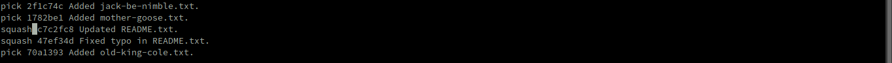


```python

```
