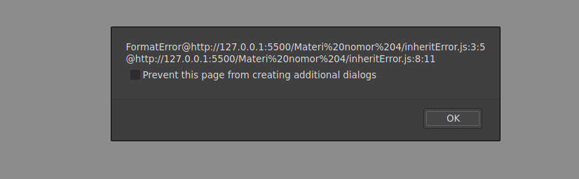

# Inheritance of Rrror

```javascript
class FormatError extends SyntaxError {
  constructor(message) {
    super(message);
    this.name = this.constructor.name;
  }
}
```

Pada block code kelas `FormatError` di atas, dia mewarisi `message` dari kelas `SyntaxError`

`let err = new FormatError("Formatting Error");`

Block kode di atas membuat objek baru yaitu `err` dengan argumen `"Formatting Error"`

```javascript
alert(err.message); // formatting error
alert(err.name); // FormatError
alert(err.stack); // stack
```

Pada block tersebut `err.message` akan menampilkan `"Formatting Error"` karena `message` berisi nilai argumen dari objek `err`.

Sementara itu, `err.name` akan menampilkan nama kelas `FormatError` yang mewarisi erro dari main class `SyntaxError`.

Dan `err.stack` akan menampilkan pesan error dari main class `SyntaxError` seperti pada gambar di bawah ini:


`alert( err instanceof SyntaxError ); // true`
Sementara itu pada kode di atas, mengecek apakah objek `err` mewarisi datanya dari class `SyntaxError` atau tidak, maka `alert` akan menampilkan hasil `true`
